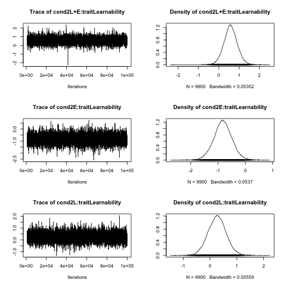
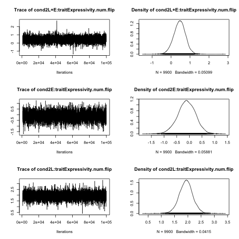
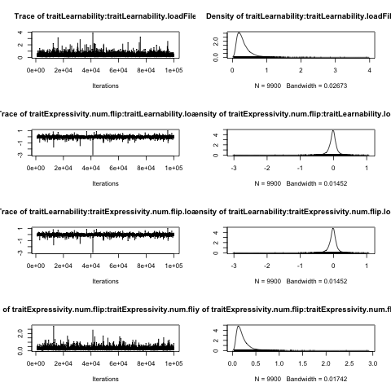
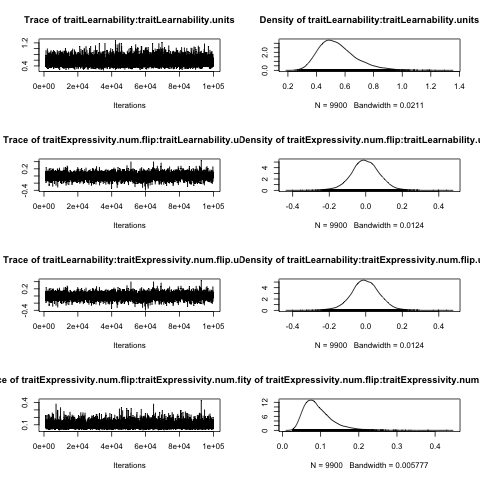

```{r echo=F}

getMEText = function(m,ef, wald=NULL, showWald=F){
  
    coef = summary(m)$coefficients
    
    if("t value" %in% colnames(coef)){
      est = signif(coef[ef,1],2)
      stder = signif(coef[ef,2],2)
      df = signif(coef[ef,3],2)
      t = signif(coef[ef,4],2)
      p = signif(coef[ef,5],2)
      return(paste("beta = ",est,", std.err = ",stder,", df = ",df, ", t = ",t,", p = ",p))
    } else{
      est = signif(coef[ef,1],2)
      stder = signif(coef[ef,2],2)
      z = signif(coef[ef,3],2)
      p = signif(coef[ef,4],2)
      return(paste("beta = ",est, "std.err ",stder, ", z = ",z,", p = ",p))
    }
}

getMStats = function(m,param){
  s = summary(m)$solutions[param,]
  s = signif(s,2)
  return(paste0(
    "(posterior mean = ",
    s['post.mean'],
    " [",
    s["l-95% CI"],
    ",",
    s["u-95% CI"],
    "], ESS = ",
    s["eff.samp"],
    ", p = ",
    s["pMCMC"],
    ")"
  )) 
}
```

# Introduction

Reminder of the phases in the experiment:

-  Phase 1.  Identify a suitable starting language, in the middle of the ExL space
-  Phase 2.  Subject such a language to 3 different types of engagement: L-only, E-only, L+E
-  Phase 3.  Measure and plot the learnability of the languages that come out of these three different types of engagement by running another generation of learners on each.

This is a visual summary of the results:


This analysis test two questions:

-  Q1: When both pressures apply, do the languages in phase 2 differ from the langauge in phase 1?

We hypothesise that when both expressivity and learnability pressures apply, the resulting languages will increase in both learnability and expressivity.

- Q2: Do the languages in phase 2 differ from each other by condition?

We hypothesise that the learnability should be lower when there is no pressure for learnability, and that the expressivity should be lower when there is no pressure for expressivity.

Q1 can be addressed using simple t-tests.  Q2 is addressed in several ways.  The first is to run two seperate mixed effects models as implemented in the R package `lme4`.  However, languages are placed in a 2-dimensional space, so we also run a multivariate regression (the learnability and expressivity are both treated as the dependent variables).  The datapoints are not independent: multiple participants in phase 3 are exposed to the same phase 2 language.  To avoid collpsing the data over phase 2 languages we can use a hierarchical model, leading to a test using a multivariate Monte Carlo Markov Chain generalised linear mixed model, as implemented in the R package `MCMCglmm`.  

We also demonstrate that the same general results are obtained when collapsing the data and using a simple linear model, and also when using a simple permutation test, which does not make assumptions about the sample size or underlying distribution of the data.

## Structure of the data

Each language only has a single expressivity value that can be calculated exactly.  However, the learnability of a language is estimated as the mean learnability from 4 participants learning the language.  In the data for phase 2 below, each row represents a phase 3 measurement of learnability for a phase 2 language.  So, for language A produced in phase 2, there are four rows in the data which represent the responses of four participants to learning language A.

Note that the data also include the learnability tests for all 4 candidate seed languages.  These can be recognised if the variable `condition` is "Seed".

The variables in the data are as follows:

-  `loadFile`: The identity of the phase 2 language being learned by phase 3 subjects.
-  `condition`: The experimental condition
-  `cond`: convenient short labels for condition
-  `phase`: Phase of the experiment
-  `seed`: Original starting language for the chain
-  `parent`: Direct parent language
-  `Expressivity.orig`: The expressivity measure (proportion of unique labels) in the original range between 0 and 1.
-  `Expressivity`: Scaled and centered expressivity measure.
-  `Expressivity.num`: The number of unique labels in the range 1 to 16.
-  `Expressivity.num.flip`: Reversed number of labels so that 1 = all unique (17 - `Expressivity.num`).
-  `Learnability.orig`: The learnability measure (proportion of labels correctly learned) in the original range between 0 and 1.
-  `Learnability`: Scaled and centered learnability measure.

\newpage

# Load libraries

```{r message=F, warning=F}
library(car)
library(caret)
library(MCMCglmm)
library(lme4)
library(lmerTest)
library(BSDA)
```

```{r echo=F, eval=F}
setwd("~/Documents/MPI/Thom/LEX_2016/analysis/")
```

# Load data

```{r}
d = read.csv("../data/ExperimentData_with_all_Learnability.csv", stringsAsFactors = F)
```

Mark conditions:

```{r}
# Short form of conditions
d$cond = factor(d$condition, levels =
      c("Learnability + Expressivity", 
        "Expressivity","Learnability"),
      labels = c("L+E","E","L"))
```

\newpage

# Q1: When both pressures apply, do the languages in phase 2 differ from the langauge in phase 1?

```{r}
d.starting = d[d$condition=="Seed" & d$seed=="Start_4",]
d.LnE = d[d$cond=="L+E" & d$phase=="PH2",]

plot(d.starting$Learnability~d.starting$Expressivity,
     ylim=c(0,1),xlim=c(0,1),
     xlab="Expressivity",
     ylab="Learnability")
points(d.LnE$Learnability~d.LnE$Expressivity, col=2)
legend(0.1,1,legend = c("Seed Language","Languages in L+E condition"), col=1:2,pch=16)
```

Test whether the mean expressivity of the PH2 languages is greater than the expressivity of the seed language (i.e. does expressivity increase?):

```{r}
orig.expressivity = d.starting$Expressivity[1]
p2.expressivity = tapply(d.LnE$Expressivity,
                         d.LnE$loadFile,
                         head, n=1)

t.ex = t.test(p2.expressivity,
              mu=orig.expressivity)
t.ex
```

Does learnability increase?

```{r}
t.test(d.starting$Learnability, d.LnE$Learnability)
```

In general, the measures of learnability for the PH2 languages are higher than the measures of learnability for the seed language.

However, the observations for learnability above are not independent.  Instead, we can test whether the mean learnability of each PH2 language is greater than the mean learnability of the seed language.

```{r}
seed.mean.Learn = mean(d.starting$Learnability)
LnE.mean.Learn = tapply(d.LnE$Learnability,
           d.LnE$loadFile, mean)

t.ln = t.test(LnE.mean.Learn, mu=seed.mean.Learn)
t.ln
```

In summary: in the condition with both a learnability and expressivity pressure, the learnability and expressivity increase.

Additional test if the systematicity increases:

```{r}
seed.Sys = d.starting$Systematicity[1]
LnE.Sys = tapply(d.LnE$Systematicity,
                         d.LnE$loadFile,
                         head, n=1)
t.sys = t.test(LnE.Sys,
              mu=seed.Sys)
t.sys
```

\newpage

## Do L-only and E-only differ from the starting condition?

The findings above logically imply that L-only and E-only conditions differ from the starting condition.  But let's just double-check that:

```{r}
d.Lonly = d[d$cond=="L" & d$phase=="PH2" & !is.na(d$Learnability),]
Lonly.mean.Learn = tapply(d.Lonly$Learnability,
           d.Lonly$loadFile, mean)

t.Lonly.ln = t.test(Lonly.mean.Learn, mu=seed.mean.Learn)
t.Lonly.ln

# Take just one row of data per phase 2 output language
Lonly.expressivity = tapply(d.Lonly$Expressivity,
                         d.Lonly$loadFile,
                         head, n=1)

t.Lonly.ex = t.test(Lonly.expressivity,
              mu=orig.expressivity)
t.Lonly.ex
```

```{r}
d.Eonly = d[d$cond=="E" & d$phase=="PH2" & !is.na(d$Learnability),]
Eonly.mean.Learn = tapply(d.Eonly$Learnability,
           d.Eonly$loadFile, mean)

t.Eonly.ln = t.test(Eonly.mean.Learn, mu=seed.mean.Learn)
t.Eonly.ln
```

All phase 2 languages in the E-only condition have an expressivity of 1.0, meaning that the standard deviation is 0 and the t-test does not apply. So we'll assume that the standard deviation is the same as for the L-only condition above:

```{r}
tsum.test(mean.x=1.0, s.x=sd(Lonly.expressivity),
          n.x=4, mu=orig.expressivity)
```

Another way to look at the problem is to calculate the probability of observing 4 perfectly expressive languages, modelling the distribution of expressivity as being drawn from all other observations of expressivity. This gives the same order of probability:

```{r}
nonE_ExpressivityValues = tapply(d[d$cond!="E" & !is.na(d$Expressivity),]$Expressivity, 
                               d[d$cond!="E" & !is.na(d$Expressivity),]$loadFile, mean)
probOfMaxExpressivity = sum(nonE_ExpressivityValues==1)/length(nonE_ExpressivityValues)
# Prob of observing 4
probOfMaxExpressivity^4
```


\newpage

# Q2: Do the languages in phase 2 differ from each other by condition?

In the L+E, we know that learnability and expressivity increase.  However, when one of the pressures is missing, does this affect the learnability?

## Prepare the data

For convenience later, save phase 2 plus seed language.

```{r}
d.PlusSeed = d[(d$phase == "PH2" & !is.na(d$Learnability)) | 
                 (d$phase=="PH1" & d$condition=="Seed" &
                    d$seed=="Start_4"),]
```

Select just Phase 2 languages:

```{r}
d = d[d$condition!="Seed" & d$phase == "PH2" & !is.na(d$Learnability),]
```

Scale measures

```{r}
d$Learnability.orig = d$Learnability
d$Expressivity.orig = d$Expressivity
d$Expressivity.num = d$Expressivity.orig*16
d$Expressivity.num.flip = 17-d$Expressivity.num

pp = preProcess(d[,c('Learnability',"Expressivity")], method="BoxCox")
lambda.Learn = pp$bc$Learnability$lambda
lambda.Exp = pp$bc$Expressivity$lambda
d$Learnability = bcPower(d$Learnability, lambda = lambda.Learn)
d$Expressivity = bcPower(d$Expressivity, lambda = lambda.Exp)


d$Learnability = scale(d$Learnability)
d$Expressivity = scale(d$Expressivity)
scaled_scale_Learn = attr(d$Learnability,"scaled:scale")
scaled_center_Learn = attr(d$Learnability,"scaled:center")
scaled_scale_Exp = attr(d$Expressivity,"scaled:scale")
scaled_center_Exp = attr(d$Expressivity,"scaled:center")
```

Function to covnert scaled variable back into proportion scale:

```{r}
rescale = function(X, lambda, 
                   scaled_scale=attr(X,"scaled:scale"),
                   scaled_center = attr(X,"scaled:center")){
  # undo scale
  X = X *scaled_scale + scaled_center
  # BC power is:
  # X = (U^(lambda)-1)/lambda
  # invert:
  return(((X*lambda)+1)^(1/lambda))
}
```


## Analysis

Fit linear mixed models.

### Learnability

The datapoints are not independent - the measures of learnability for a language in phase 2 come from different participants in phase 3 learning the same langauge.  So there needs to be a random effect for phase 2 source langauge.  Random intercepts are added, but condition does not vary by phase 2 source language, so random slopes are not permissable.

Check the normality of the Learnability variable:

```{r}
hist(d$Learnability)
shapiro.test(d$Learnability)
```

Perform a mixed effects model:

```{r}
mL = lmer(Learnability ~ 1 + cond + 
             (1 | loadFile),
          data =d)

summary(mL)
```

### Expressivity

The expressivity values are calculable directly from the phase 2 output languages, and do not need the extra phase 3 steps.  Therefore, only one row from the data for each phase 2 language should go into the analysis.  This also means that the datapoints are independent, so no random effects are needed.

The expressivity measure is highly skewed, but is underlyingly only whole numbers (the number of unique labels), so we'll use a poisson distribution.  The expressivity measure limits are from 1 to 16.  The actual values range from 8 to 16.  To capture the hard upper limit and prevent the model from predicting expressivity values above 1, we flip the scale (`17 - number of unique labels`).


```{r}
mE = glm(Expressivity.num.flip ~ 1 + cond,
          data =d[!duplicated(d$loadFile),], 
         family=poisson(link="log"))
```

Check predictions:

```{r}
predictions = -(exp(predict(mE))-17)
plot(predictions,d[!duplicated(d$loadFile),]$Expressivity.num)
abline(0,1)
```

Results:

```{r}
summary(mE)
```

### Rescale estimates

```{r}
coefL = summary(mL)$coefficients[,1]
intrL = coefL[1]

learn_bothPressures = rescale(intrL,
                              lambda.Learn, 
                              scaled_scale_Learn,
                              scaled_center_Learn)
learn_noLearnPressure = rescale(intrL+coefL["condE"],
                                  lambda.Learn, 
                                  scaled_scale_Learn,                                                   scaled_center_Learn)
learn_noExpPressure = rescale(intrL+coefL["condL"],
                                  lambda.Learn,
                                  scaled_scale_Learn, 
                                  scaled_center_Learn)
coefE = summary(mE)$coefficients[,1]
intrE = coefE[1]
exp_bothPressures = (-(exp((intrE))-17))/16
exp_noLearnPressure = (-(exp((intrE+coefE["condE"]))-17))/16
exp_noExpPressure = (-(exp((intrE+coefE["condL"]))-17))/16
```


\newpage

# Summary


*Q1:*

We hypothesised that when both expresivity and learnability pressures apply, the resulting languages would increase in both learnability and expressivity.  We used a simple t-test to compare the mean measures of the languages in phase 2 to the mean measures of the starting language.  

When both pressures apply, the expressivity increases (t = `r t.ex$statistic`, df = `r t.ex$parameter`, p = `r t.ex$p.value`) and the learnability increases (t = `r t.ln$statistic`, df = `r t.ln$parameter`, p = `r t.ln$p.value`) compared to the seed language.

*Q2:*

Taking the condition with both learnability and expressivity pressures as a reference, we hypothesised that the learnability should be lower when there is no pressure for learnability, and that the expressivity should be lower when there is no pressure for expressivity.  

Without a learnability pressure, the learnability drops from `r learn_bothPressures` to `r learn_noLearnPressure` (`r getMEText(mL,"condE")`), but expressivity does not significantly differ (`r getMEText(mE,"condE")`).  

Without an expressivity pressure, the expressivity drops from `r exp_bothPressures` to `r exp_noExpPressure` (`r getMEText(mE,"condL")`), but the learnability does not significantly differ (`r getMEText(mL,"condL")`).

Qualitatively similar results were obtained by simpler linear regression, mixed multivariate regression and permutation (below).


\newpage

# Permutation tests

The tests above make assumptions about the distribution of the variables.  We can relax this assumption by using a permutation test on the mean learnability and expressivity measures for each language in phase 2.  The tests below show that the results are qualitatively the same, and the effect sizes are also similar.

This is a function that tests whether the true difference in means between two samples is greater than the difference when the assignment of observations is permuted between the samples:

```{r}
perm.diff = function(a,b,n=1000){
  # real difference between samples a and b
  true.diff = diff(c(mean(a),mean(b)))
  # permute the values between a and b, and return the difference in means
  perm.diff = replicate(n,
        diff(tapply(c(a,b),
         sample(c(rep("a",length(a)),
           rep("b",length(b)))),
         mean)))
  # proportion of permuted differences less than the true difference
  p = sum(perm.diff<true.diff)/n
  # If there are none, set the probability to 1 / the number of permutations
  if(p==0){
    p = 1/n
  }
  # Z-score 
  z = (true.diff-mean(perm.diff))/sd(perm.diff)
  return(c(diff.in.means=true.diff,z=z,p=p))
}
```

Collapse means over each phase 2 language:

```{r}
d.mean = data.frame(
  Learnability=tapply(d$Learnability,d$loadFile,mean),
  Expressivity=tapply(d$Expressivity,d$loadFile,mean),
  Learnability.orig = tapply(d$Learnability.orig,d$loadFile,mean),
  Expressivity.orig = tapply(d$Expressivity.orig,d$loadFile,mean),
  cond = as.factor(tapply(as.character(d$cond),d$loadFile,head,n=1))
)
d.mean$cond = relevel(d.mean$cond,"L+E")
```

Without a learnability pressure, the learnability is significantly lower:

```{r}
set.seed(2378)
perm.diff(
  d.mean$Learnability.orig[d.mean$cond=="L+E"],
  d.mean$Learnability.orig[d.mean$cond=="E"])
```

... but expressivity does not significantly differ:

```{r}
set.seed(212)
perm.diff(
  d.mean$Expressivity.orig[d.mean$cond=="L+E"],
  d.mean$Expressivity.orig[d.mean$cond=="E"])
```

Without an expressivity pressure, the expressivity is significantly lower:

```{r}
set.seed(887)
perm.diff(
  d.mean$Expressivity.orig[d.mean$cond=="L+E"],
  d.mean$Expressivity.orig[d.mean$cond=="L"])
```


... but the learnability does not significantly differ:

```{r}
set.seed(768)
perm.diff(
  d.mean$Learnability.orig[d.mean$cond=="L+E"],
  d.mean$Learnability.orig[d.mean$cond=="L"])
```

\newpage

# Multivariate model

The data can be thought of as two-dimnesional: languages have an expressivity score and a learnability score, so we can use a multivariate model.  We used a multivariate hierarchical model, predicting both learnability and expressivity by condition, with random effects for the phase 2 language whose learnability was being measured.


```{r warning=F}
# This sets L+E as the reference condition
d$cond2 = factor(d$cond,levels=c("L+E","E","L"))
set.seed(1234)
prior = list(R = list(V = diag(2)/3, n = 2),
             G = list(G1 = list(V = diag(2)/3, n = 2)))

m <- MCMCglmm(
  cbind(Learnability,Expressivity.num.flip) ~ 
                -1 + cond2:trait,
              random = ~ us(trait):loadFile, 
              rcov = ~ us(trait):units,
              prior = prior, 
              family = c("gaussian", "poisson"), 
              nitt = 100000, 
              burnin = 1000,
              thin = 10,
              data = d,
              verbose = F)

summary(m)
```


\newpage

### Check convergence

```{r}
for(i in list(1:3,4:6)){
  png(paste0("../results/MCMCglmm/MCMCConvergence_",i[1],".png"))
  plot(m$Sol[,i])
  dev.off()
}
for(i in list(1:4,5:8)){
  png(paste0("../results/MCMCglmm/MCMCConvergence_VCV_",i[1],".png"))
  plot(m$VCV[,i])
  dev.off()
}
```










Scale model estimates back into original units:

```{r}
coef = summary(m)$solutions[,1]

learn_bothPressures = rescale(coef["cond2L+E:traitLearnability"],
                              lambda.Learn, 
                              scaled_scale_Learn,
                              scaled_center_Learn)

learn_noLearnPressure = rescale(coef["cond2E:traitLearnability"],
                                  lambda.Learn, 
                                  scaled_scale_Learn,
                                  scaled_center_Learn)
learn_noExpPressure = rescale(coef["cond2L:traitLearnability"],
                                  lambda.Learn,
                                  scaled_scale_Learn, 
                                  scaled_center_Learn)
exp_bothPressures = (-(exp((coef["cond2L+E:traitExpressivity.num.flip"]))-17))/16
exp_noLearnPressure = (-(exp((coef["cond2E:traitExpressivity.num.flip"]))-17))/16
exp_noExpPressure = (-(exp((coef["cond2L:traitExpressivity.num.flip"]))-17))/16
```

Calculate confidence intervals:

```{r}
cis = summary(m)$solutions[,2:3]
learn_bothPressures.ci = rescale(cis["cond2L+E:traitLearnability",],
                              lambda.Learn, 
                              scaled_scale_Learn,
                              scaled_center_Learn)

learn_noLearnPressure.ci = rescale(cis["cond2E:traitLearnability",],
                                  lambda.Learn, 
                                  scaled_scale_Learn,
                                  scaled_center_Learn)
learn_noExpPressure.ci = rescale(cis["cond2L:traitLearnability",],
                                  lambda.Learn,
                                  scaled_scale_Learn, 
                                  scaled_center_Learn)
exp_bothPressures.ci = (-(exp((cis["cond2L+E:traitExpressivity.num.flip",]))-17))/16
exp_noLearnPressure.ci = (-(exp((cis["cond2E:traitExpressivity.num.flip",]))-17))/16
exp_noExpPressure.ci = (-(exp((cis["cond2L:traitExpressivity.num.flip",]))-17))/16


```


Check that the model estimates are accurate (circles are real data, diamonds are morel estimates):

```{r}
plot(d$Learnability.orig~
       d$Expressivity.orig, 
     col=(as.numeric(d$cond2)))
# Mean points
points(exp_noLearnPressure, learn_noLearnPressure, pch=18,col=2, cex=3)
points(exp_noExpPressure, learn_noExpPressure, pch=18,col=3,cex=3)
points(exp_bothPressures, learn_bothPressures, pch=18,col=1,cex=3)

# CIs
arrows(exp_noLearnPressure, 
       learn_noLearnPressure.ci[1],
       exp_noLearnPressure,
       learn_noLearnPressure.ci[2],angle = 90,code = 3,col=2)
arrows(exp_noLearnPressure.ci[1], 
       learn_noLearnPressure,
       exp_noLearnPressure.ci[2],
       learn_noLearnPressure,angle = 90,code = 3,col=2)
arrows(exp_noExpPressure, 
       learn_noExpPressure.ci[1],
       exp_noExpPressure,
       learn_noExpPressure.ci[2],angle = 90,code = 3,col=3)
arrows(exp_noExpPressure.ci[1], 
       learn_noExpPressure,
       exp_noExpPressure.ci[2],
       learn_noExpPressure,angle = 90,code = 3,col=3)
arrows(exp_bothPressures, 
       learn_bothPressures.ci[1],
       exp_bothPressures,
       learn_bothPressures.ci[2],angle = 90,code = 3,col=1)
arrows(exp_bothPressures.ci[1], 
       learn_bothPressures,
       exp_bothPressures.ci[2],
       learn_bothPressures,angle = 90,code = 3,col=1)

```


### Summary

*Q2:*

Without a learnability pressure, the learnability drops from `r learn_bothPressures` to `r learn_noLearnPressure`.  

Without an expressivity pressure, the expressivity drops from `r exp_bothPressures` to `r exp_noExpPressure` `r getMStats(m,"cond2L:traitExpressivity.num.flip")`.

Note that the probabilities above reflect the probability of the given parameter estimate being greater than zero, they are not indicative of a comparison between he L+E condition and the given parameter.  However, the confidence intervals for the parameter estimates do not overlap for the predicted comparisons, indicating significance.

\newpage

# Linear model

Run a multivariate linear model:

```{r}
m.lm = lm(cbind(Learnability,
                Expressivity) ~ cond, data=d.mean)
summary(m.lm)

```

Rescale the estimates back into the original scales:

```{r}
learnEandL = rescale(coef(m.lm)[1,1], lambda.Learn,
                     scaled_scale_Learn, 
                     scaled_center_Learn)
expEandL = rescale(coef(m.lm)[1,2], lambda.Learn,
                   scaled_scale_Exp, 
                   scaled_center_Exp)

learnDiff_noLearnPressure = rescale(coef(m.lm)[1,1]+coef(m.lm)[2,1],
                                    lambda.Learn, 
                                    scaled_scale_Learn, 
                                    scaled_center_Learn)
learnDiff_noExpPressure = rescale(coef(m.lm)[1,1]+coef(m.lm)[3,1],
                                  lambda.Learn,
                                  scaled_scale_Learn, 
                                  scaled_center_Learn)
expDiff_noLearnPressure = rescale(coef(m.lm)[1,2]+coef(m.lm)[2,2],lambda.Exp,
                                  scaled_scale_Exp, 
                                  scaled_center_Exp)
expDiff_noExpPressure = rescale(coef(m.lm)[1,2]+coef(m.lm)[3,2],
                                lambda.Exp,
                                scaled_scale_Exp, 
                                scaled_center_Exp)

lx = as.character(learnEandL)
```

### Summary

Without a learnability pressure, the learnability drops from `r as.character(learnEandL)` to `r learn_noLearnPressure` (p = `r summary(m.lm)$"Response Learnability"$coefficients["condE",'Pr(>|t|)']`), 
but expressivity does not significantly differ (p = `r summary(m.lm)$"Response Expressivity"$coefficients["condE",'Pr(>|t|)']`). 


Without an expressivity pressure, the expressivity drops from `r exp_bothPressures` to `r exp_noExpPressure` (p = `r as.character(format(round(summary(m.lm)$"Response Expressivity"$coefficients["condL",'Pr(>|t|)'],6),scientific=F))`), but the learnability does not significantly differ (p = `r summary(m.lm)$"Response Learnability"$coefficients["condL",'Pr(>|t|)']`).
